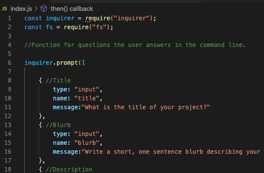
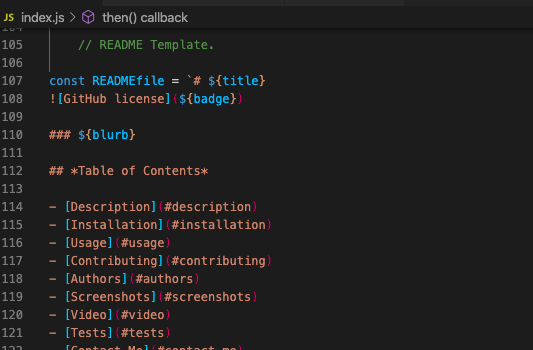

# NodeJS-README-Generator
[](https://bwaycarl.github.io/Portfolio/)
[](https://github.com/BwayCarl/Node-README-Generator/blob/master/LICENSE)
[](https://github.com/BwayCarl/Node-README-Generator/issues)
[](https://github.com/BwayCarl/Node-README-Generator/network)
[](https://github.com/BwayCarl/Node-README-Generator/stargazers)

### A command line interface to generate a README file.

## *Table of Contents*
- [Description](#description)
 - [Installation](#installation)
 - [Usage](#usage)
 - [Contributing](#contributing)
 - [Authors](#authors)
 - [Screenshots](#screenshots)
 - [Video](#video)
 - [Tests](#tests)
 - [Contact Me](#contact-me)
 - [License](#license)

## *Description* 
 When creating an open source project on GitHub, it is important to have a quality README with information about the app--what is the app for, how to use the app, how to install it, how to report issues, and how to make contributions so that other developers are more likely to use and contribute to the success of the project. A command-line application will allow for quick and easy generation of a project README to get started quickly. This will allow a project creator to spend more time working on finishing the project and less time creating a good README.

## *Installation* 
 ```npm i inquirer```

## *Usage*
 Enter ```node index.js``` into your command line and answer the questions provided in the terminal.

## *Contributing* 
 Feel free to contribute. Just contact me and fork away!

## *Authors* 
 Carlos Martinez

## *Screenshots* 
 

 

 

 ## *Video*

###  :movie_camera: [YouTube Video of the project in action.](https://youtu.be/QYEO4B7FDZQ)

## *Tests*
 ```npm test```

## *Contact Me*
 - Github: **[BwayCarl](https://github.com/BwayCarl)**
 - LinkedIn: **[Carlos Martinez](https://www.linkedin.com/in/carlos-martinez-8702b146/)** 
 - Twitter: **[@BwayCarlDev](https://twitter.com/BwayDev)**
 - Email: **[bwaycarl@gmail.com](mailto:bwaycarl@gmail.com)**

## *License* 
[](https://github.com/BwayCarl/Node-README-Generator/blob/master/LICENSE)
 
 &copy; 2020, Carlos Martinez
